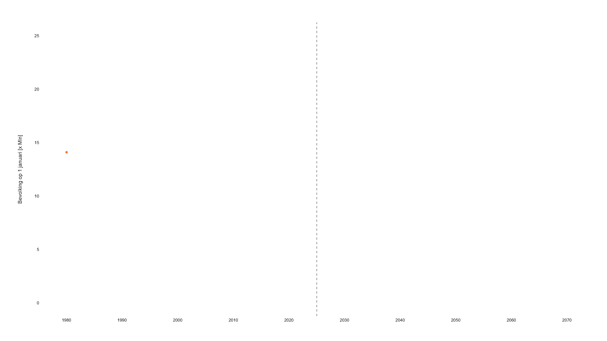

---
output:
  html_document:
    includes:
      before_body: left-banner.html
    css: "style.css"
    theme: cosmo
    toc: yes
    toc_depth: 5
    toc_float:
      collapsed: true
      smooth_scroll: true
editor_options: 
  chunk_output_type: console
---

```{r include=FALSE}
aniview::use_aniview()
```

# Toekomstverkenning

## Inleiding

Het Nederlandse voetbal kent al meer dan 130 jaar aan geschiedenis. Het
kan daarmee met recht begrip worden genoemd. In de loop van die
geschiedenis is het Nederlands voetbal gekenmerkt door internationaal
topprestaties van onder andere clubs, nationale teams en individuele
spelers. Behaalde prestaties zijn daarmee dus een belangrijke, maar
tevens ook een relatief smalle indicator voor de definiëring van het
Nederlands voetbal. Het Nederlands voetbal gaat over meer; zo zijn er
financieel-economische aspecten die, vooral na het ontstaan van het
*betaald* voetbal, minstens zo belangrijk zijn in de definiëring van het
Nederlands voetbal.

Het Nederlands voetbal bevat ook sociaal-maatschappelijke aspecten. De
zogenaamde 'participatiegraad' (6.9% van de Nederlandse bevolking is lid
van een voetbalvereniging)[^1] laat bijvoorbeeld zien dat het
Nederlandse voetbal een omvang van de maatschappij beslaat die maar door
weinig andere domeinen wordt bereikt. Niet gek dus dat tegenwoordig het
voetbal, en sport in algemene zin, ook als middel wordt gezien voor het
stimuleren van gezond gedrag en daarmee een belangrijke rol speelt in
maatschappelijke thema's zoals een gezonde leefstijl van toekomstige
([VTV, 2024]).

De sociaal-maatschappelijke aspecten van het Nederlands voetbal blijven
overigens niet beperkt tot leden alleen. Naast deze vorm van
participatie, zijn er ook nog individuen die meeleven met het Nederlands
voetbal (als toeschouwer, volger, supporter, of hoe dan ook), wat de
sociaal-maatschappelijke aspecten nog maar eens extra benadrukt. Zo
blijkt bijvoorbeeld uit onderzoek van PwC ([ref]) dat Nederland
ruim 9,7 miljoen voetballiefhebbers[^2] telt. Dat is meer dan de helft
van de totale bevolking. Daarnaast geeft bijna de helft van deze
voetballiefhebbers aan dat het betaald voetbal bijdraagt aan hun mentale
gezondheid en hun sociale netwerk.

### Het Nederlands Voetbal

Om in deze toekomstverkenning van het Nederlands voetbal de trends en
ontwikkelingen te beschrijven die van invloed zijn op het voetbal,
definiëren we het Nederlands voetbal als het geheel van prestaties en
betrokkenheid in de vorm van deelname en beleving. Door het Nederlands
voetbal op deze manier te karakteriseren, zijn er drie domeinen te
onderscheiden: Presteren, Meeleven en Meedoen.

Deze domeinen vormen een eerste raamwerk, maar voor het uitvoeren van de
toekomstverkenning is wel een meer verfijnde indeling nodig. We
definiëren daarom XX inhoudelijke thema's van het Nederlands voetbal,
waarop de effecten van trends en ontwikkelingen beter inzichtelijk
kunnen worden gemaakt. Elk afzonderlijk thema werpt licht op een
specifiek onderdeel dat van belang is voor de toekomstverkenning van het
Nederlands voetbal.

#### Meedoen.

Het domein meedoen gaat over alles wat te maken heeft met organiseren en
aanbieden van Nederlandse breedtevoetbal op een wijze die aansluit bij
de behoefte en wensen van iedere doelgroep die betrokken is bij het
Nederlandse breedtevoetbal.

<h5>*Thema 1 Voetbalparticipatie:*</h5>Het eerste thema gaat in de kern over het aandeel waarin de Nederlandse bevolking betrokken is bij het Nederlands voetbal als lid van de KNVB. Naast voetballers, gaat het hierbij ook om individuen in andere rollen zoals die van voetbalcoach of bestuurder.</p> 

<h5>*Thema 2* *Vitale verenigingen:*</h5>Om mee te kunnen doen in het Nederlandse voetbal zijn vitale verenigingen belangrijk. Daarom gaat dit thema over de organisatiekracht van het breedtevoetbal in Nederland. De organisatiekracht van een vereniging is de mate waarin zij in staat zijn om voetbalaanbod te organiseren. Dit wordt mede bepaald door et hebben van voldoende leden, besturend en organiserend kader, een geschikte accommodatie, voldoende financiën en een duidelijk beleid.</p>

<h5>*Thema 3 Ruimte voor voetbal:*</h5>Dit thema volgt vanuit het inzicht dat, om mee te kunnen doen in het Nederlands voetbal, er voldoende ruimte moet zijn voor het voetbalaanbod. Onder dit thema valt alles wat in de openbare ruimte aanwezig is om voetballen te faciliteren, daarbij gaat het natuurlijk vooral om accommodaties, maar ook sporthallen (futsal), footy veldjes, en X vallen hieronder.</p>

#### Presteren.

Het domein presteren gaat over de competitiviteit van het Nederlandse
topvoetbal in zowel het internationale club- als vertegenwoordigend
voetbal. Het gaat onder andere over competitieformats en -regelgeving,
de betrokkenheid van stakeholders in de vorm van *governance*,
verhouding en samenstelling van staf, en transfers.

<h5>*Thema 4 Nationale en internationale competitiviteit:*</h5>Het thema competitiviteit gaat over de mate waarin Nederlandse betaaldvoetbalclubs en vertegenwoordigende elftallen in staat zijn te presteren op internationaal niveau.</p>

<h5>*Thema 5 Organisatie van het betaald voetbal:*</h5>Het thema organisatie gaat over de institutionele structuur waarbinnen het Nederlandse topvoetbal wordt georganiseerd. Het gaat dan voornamelijk over de regulatie en *governance* van het betaald voetbal.</p>

<h5>*Thema 6 Nederland als opleidingsland:*</h5>Het opleiden en ontwikkelen van spelers is een belangrijk fundament van de competitiviteit van het Nederlands topvoetbal. Het heeft zowel een directe relatie met prestaties doordat het opleiden van talentvolle spelers, de kwaliteit van teams kan verhogen, als een indirecte relatie doordat het verkopen van spelers en het generen van transferinkomsten via financiële slagkracht de mogelijkheid op nog betere spelers vergroot.</p>

Lorem ipsum dolor sit amet, consectetur adipiscing elit. Aliquam est lorem, feugiat et tempor ut, vestibulum ut lectus. Vestibulum laoreet risus in tellus imperdiet tempor quis sit amet augue. Duis vestibulum urna in nunc viverra, blandit mollis arcu rutrum. Quisque in consectetur dolor. Quisque eu quam vel risus euismod aliquet. Suspendisse ante tortor, ultricies at egestas quis, posuere sed orci. Aenean blandit dui vel nulla feugiat, sed vestibulum orci faucibus. Proin nibh quam, cursus vitae elit vel, laoreet pellentesque felis. Aliquam elit arcu, lobortis eu faucibus nec, sagittis sit amet tortor. Nulla facilisi. Morbi in purus non nisl rhoncus blandit id sed nisi. Suspendisse potenti.

Proin dictum turpis eu pellentesque tincidunt. Vestibulum congue molestie purus, scelerisque fermentum nunc venenatis dictum. Aliquam erat volutpat. Quisque dapibus odio neque, non pretium nunc bibendum ac. Vestibulum sapien ipsum, malesuada eu elementum at, varius quis leo. Etiam sit amet risus vel diam feugiat aliquet. Etiam sagittis interdum sapien, in interdum tortor elementum dictum. Curabitur varius neque fermentum erat congue condimentum. Nam dapibus eu leo et cursus. Quisque pharetra lacus quis tempus faucibus.

Etiam at venenatis velit. Integer vehicula enim dui, et fringilla sapien pretium quis. Nulla sed magna sed augue tempor pharetra. Nunc felis quam, facilisis quis nulla sit amet, condimentum gravida libero. Sed pellentesque a ligula quis pulvinar. Nam dapibus nunc a tortor bibendum porttitor sed nec ipsum. Integer quis varius magna, in rutrum odio. Sed dolor magna, aliquam vel eros vitae, pellentesque interdum ante. Nunc sed lorem a risus rhoncus volutpat at fringilla justo. Cras augue arcu, elementum at pretium a, euismod vitae elit. Aliquam mollis risus nibh, eget luctus ligula finibus vel. Aliquam congue lobortis enim, vitae tempus elit lobortis eget. Suspendisse at interdum nisi, in pharetra erat. Morbi pellentesque vestibulum lacus sed efficitur. In orci metus, consequat sit amet neque a, consectetur pharetra massa.

Pellentesque non vestibulum est, non molestie risus. Suspendisse euismod ipsum nec lacus vehicula egestas. Nunc tincidunt neque nec porttitor sollicitudin. Praesent elementum quam eu sapien mollis, at lacinia risus condimentum. Sed feugiat risus vel interdum fermentum. Ut ut turpis quam. Maecenas sodales felis eget ligula bibendum, vel efficitur sapien sodales. Donec pharetra finibus tellus, vitae dignissim risus hendrerit a. Mauris eget ligula nisi. Nullam arcu est, scelerisque in rutrum a, placerat nec mi. Suspendisse efficitur diam quis leo tincidunt suscipit ac et turpis.

Nullam tortor lectus, tristique eget ligula sit amet, sagittis imperdiet enim. Sed finibus, elit suscipit maximus sodales, quam nibh fermentum eros, eu fringilla ipsum felis sit amet turpis. Ut iaculis convallis nulla eu egestas. Sed ipsum diam, ullamcorper et commodo sed, venenatis at nunc. Phasellus dapibus dignissim orci, vitae bibendum mi egestas blandit. Donec suscipit, elit mattis tempor blandit, lectus erat volutpat lacus, et porta enim erat eget eros. Praesent nisl sapien, ornare dignissim nisl vel, pharetra faucibus leo.

Lorem ipsum dolor sit amet, consectetur adipiscing elit. Aliquam est lorem, feugiat et tempor ut, vestibulum ut lectus. Vestibulum laoreet risus in tellus imperdiet tempor quis sit amet augue. Duis vestibulum urna in nunc viverra, blandit mollis arcu rutrum. Quisque in consectetur dolor. Quisque eu quam vel risus euismod aliquet. Suspendisse ante tortor, ultricies at egestas quis, posuere sed orci. Aenean blandit dui vel nulla feugiat, sed vestibulum orci faucibus. Proin nibh quam, cursus vitae elit vel, laoreet pellentesque felis. Aliquam elit arcu, lobortis eu faucibus nec, sagittis sit amet tortor. Nulla facilisi. Morbi in purus non nisl rhoncus blandit id sed nisi. Suspendisse potenti.

Proin dictum turpis eu pellentesque tincidunt. Vestibulum congue molestie purus, scelerisque fermentum nunc venenatis dictum. Aliquam erat volutpat. Quisque dapibus odio neque, non pretium nunc bibendum ac. Vestibulum sapien ipsum, malesuada eu elementum at, varius quis leo. Etiam sit amet risus vel diam feugiat aliquet. Etiam sagittis interdum sapien, in interdum tortor elementum dictum. Curabitur varius neque fermentum erat congue condimentum. Nam dapibus eu leo et cursus. Quisque pharetra lacus quis tempus faucibus.

Etiam at venenatis velit. Integer vehicula enim dui, et fringilla sapien pretium quis. Nulla sed magna sed augue tempor pharetra. Nunc felis quam, facilisis quis nulla sit amet, condimentum gravida libero. Sed pellentesque a ligula quis pulvinar. Nam dapibus nunc a tortor bibendum porttitor sed nec ipsum. Integer quis varius magna, in rutrum odio. Sed dolor magna, aliquam vel eros vitae, pellentesque interdum ante. Nunc sed lorem a risus rhoncus volutpat at fringilla justo. Cras augue arcu, elementum at pretium a, euismod vitae elit. Aliquam mollis risus nibh, eget luctus ligula finibus vel. Aliquam congue lobortis enim, vitae tempus elit lobortis eget. Suspendisse at interdum nisi, in pharetra erat. Morbi pellentesque vestibulum lacus sed efficitur. In orci metus, consequat sit amet neque a, consectetur pharetra massa.

Pellentesque non vestibulum est, non molestie risus. Suspendisse euismod ipsum nec lacus vehicula egestas. Nunc tincidunt neque nec porttitor sollicitudin. Praesent elementum quam eu sapien mollis, at lacinia risus condimentum. Sed feugiat risus vel interdum fermentum. Ut ut turpis quam. Maecenas sodales felis eget ligula bibendum, vel efficitur sapien sodales. Donec pharetra finibus tellus, vitae dignissim risus hendrerit a. Mauris eget ligula nisi. Nullam arcu est, scelerisque in rutrum a, placerat nec mi. Suspendisse efficitur diam quis leo tincidunt suscipit ac et turpis.

Nullam tortor lectus, tristique eget ligula sit amet, sagittis imperdiet enim. Sed finibus, elit suscipit maximus sodales, quam nibh fermentum eros, eu fringilla ipsum felis sit amet turpis. Ut iaculis convallis nulla eu egestas. Sed ipsum diam, ullamcorper et commodo sed, venenatis at nunc. Phasellus dapibus dignissim orci, vitae bibendum mi egestas blandit. Donec suscipit, elit mattis tempor blandit, lectus erat volutpat lacus, et porta enim erat eget eros. Praesent nisl sapien, ornare dignissim nisl vel, pharetra faucibus leo.

::: {.aniview data-av-animation="slideInUp"}

:::

#### Meeleven.

Het laatste domein binnen Nederlands voetbal vertrekt vanuit het idee
dat voetbal niet alleen een spel is, maar ook een product. Eén die diepe
sociaal-culturele sporen met zich meebrengt. Daarom onderscheiden we
binnen de definitie van het Nederlands voetbal ook meeleven. Met de
constatering dat het Nederlands voetbal ook een product is, bestaat er
dus ook zoiets als een markt. Deze markt moet concurreren met andere
vormen van consumptie, zoals het volgen van andere sporten. In de
uitwerking van de thema's binnen dit domein onderscheiden we
verschillende vormen van meeleven: als fan of supporter, als volger en
consument, en ook als maatschappij

<h5>*Thema 7 Fanbeleving- en betrokkenheid:*</h5>Dit thema gaat over het volgen van voetbal, clubs en of individuele spelers. Dit kan op verschillende manieren zoals via (sociale) media en het bezoeken van wedstrijden.</p>

<h5>*Thema 8 Consumptie en het volgen van voetbal:*</h5>Net als het vorige thema, gaat het in dit thema ook over het volgen van voetbal. Echter, naast *wat* er gevolgd wordt zoals bijvoorbeeld wedstrijden, toernooien of individuele spelers, gaat dit thema vooral over de wijze waarop.</p> 

<h5>*Thema 9 Maatschappelijke impact:*</h5>Als laatste thema binnen het domein leven gaat het om de maatschappelijke impact van het voetbal. Zelfs als je niet actief voetbal volgt of consumeert, is de impact van het voetbal zichtbaar in onze maatschappij. Het voetbal brengt mensen samen en stimuleert gezond gedrag in de vorm van beweging wat lagere zorgkosten tot gevolg heeft.

## Referenties

CBS (2025). Bevolkingsontwikkeling; maand en jaar. Geraadpleegd op
03-04-2025

[^1]: In november 2024 rapporteerde de KNVB dat er 1.240.437
    Nederlanders zijn aangesloten bij een voetbalvereniging. De
    bevolkingsgrootte aan het einde van deze maand was 18.045.683 (CBS,
    2025)

[^2]: [Insert definitie voetballiefhebber rapport PwC] -\>
    voetballiefhebbers, dit zijn mensen die geïnteresseerd zijn in
    betaald voetbal (p14)

[^3]: DESTEP wordt vaker toegepast in toekomstverkenningen, zoals in de
    Volksgezondheid Toekomst Verkenning (RIVM, 2024), Sport Toekomstverkenning 
    (RIVM, 2017) en Food 2030 (ING, 2012).


